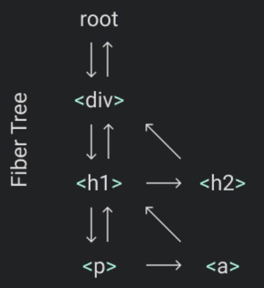
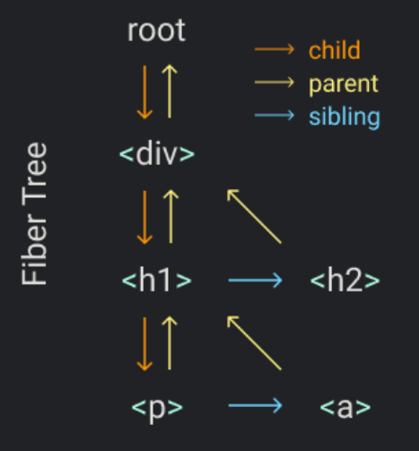
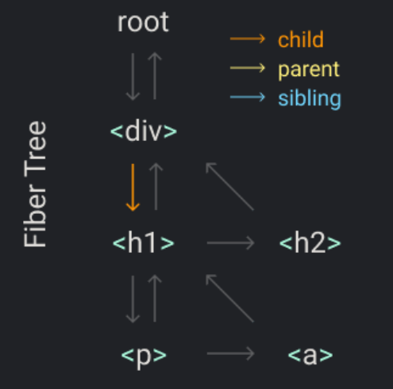
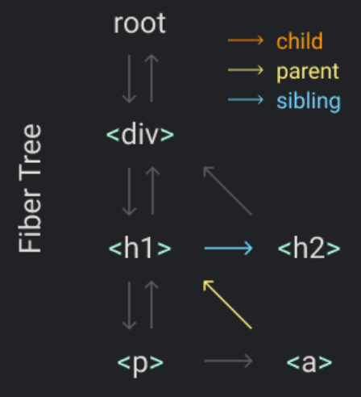

## Fibers 架构


为了组织我们工作的所有单元，我们需要一个数据结构：a fiber tree

我们将为每个元素分配一根光纤，而且每根光纤都将成为一个工作单元。

让我来为你展示一个例子。

假定我们需要渲染的元素树就想这样
```js
Didact.render(
  <div>
    <h1>
      <p />
      <a />
    </h1>
    <h2 />
  </div>,
  container
)
```

在 `render` 中，我们将创建根光纤（root），并且将它设置为 `theNextUnitOfWork`。剩下的工作将在 `performUnitOfWork` 函数中执行，对每根光纤我们将做三件事：   
1. 将元素添加进 DOM
2. 为这个元素的孩子创建光纤
3. 选定一下个工作单元

这个数据结构的一个目的就是使找到下一个找工作单元更加的简单。这就是为什么每一个光纤都有一个连接到他的孩子，到他的下一个兄弟以及到他的父亲。    


当我们完成一个光纤上的工作，如果它有一个孩子，那么将成为下一个工作单元。

从我们的例子来看，当我们完成这个 `div` 光纤，下一个工作单元就是这个 `h1` 光纤。     


如果这个光纤没有孩子，我们使用它的兄弟作为下一个工作单元。例如 `p` 没有孩子，所以我们在它完成之后移动到 `a`。

如果光纤既没有孩子也没有兄弟姐妹，那么我们去“叔叔”：父母的兄弟姐妹。 就像示例中的a和h2光纤一样。

另外，如果父母没有兄弟姐妹，我们会不断检查父母，直到找到有兄弟姐妹的父母，或者直到找到根。 如果到达根目录，则意味着我们已经完成了此渲染的所有工作。    


现在我们用代码将这些实现。

首先我们移除 `render` 函数中的代码我们在原来的函数中保持创建一个 DOM 节点的功能，稍后会用到。
```js
function createDom(fiber) {
  const dom =
    fiber.type == "TEXT_ELEMENT"
      ? document.createTextNode("")
      : document.createElement(fiber.type)
​
  const isProperty = key => key !== "children"
  Object.keys(fiber.props)
    .filter(isProperty)
    .forEach(name => {
      dom[name] = fiber.props[name]
    })
​
  return dom
}
​
function render(element, container) {
  // TODO set next unit of work
}
​
let nextUnitOfWork = null
```

在 `render` 函数中我们设置 `nextUnitOfWork` 为 fiber tree 的根。
```js
function render(element, container) {
  nextUnitOfWork = {
    dom: container,
    props: {
      children: [element]
    }
  }
}
```

然后，当浏览器准备好的时候，它将调用我们的 `workloop`，我们将在根节点开始工作。
```js
function workLoop(deadline) {
  let shouldYield = false
  while (nextUnitOfWork && !shouldYield) {
    nextUnitOfWork = performUnitOfWork(
      nextUnitOfWork
    )
    shouldYield = deadline.timeRemaining() < 1
  }
  requestIdleCallback(workLoop)
}
​
requestIdleCallback(workLoop)

function performUnitOfWork(fiber) {
  // TODO add dom node
  // TODO create new fibers
  // TODO return next unit of work
}
```

首先，我们创建一个新的节点，并将它添加进 DOM 中。我们在 `fiber.dom` 中保持对这个 DOM 节点的跟踪。
```js
function performUnitOfWork(fiber) {
  if(!fiber.dom) {
    fiber.dom = createDom(fiber);
  }

  if(fiber.parent) {
    fiber.parent.dom.appendChild(fiber.dom);
  }
  // TODO create new fibers
  // TODO return next unit of work
}
```

然后对每一个孩子我们创建一个新的光纤。并且我们将它添加进 fiber tree 中，将其设置为孩子还是兄弟，具体取决于它是否是第一个孩子。
```js
function performUnitOfWork(fiber) {
  if(!fiber.dom) {
    fiber.dom = createDom(fiber);
  }

  if(fiber.parent) {
    fiber.parent.dom.appendChild(fiber.dom);
  }

  const elements = fiber.props.children;
  let index = 0;
  let prevSibling = null;

  while(index < elements.length) {
    const element = elements[index];

    const newFiber = {
      type: element.type,
      props: element.props,
      parent: fiber,
      dom: null
    }

    if(index === 0) {
      fiber.child = newFiber;
    } else {
      prevSibling.sibling = newFiber;
    }

    prevSibling = newFiber;
    index++;
  }

  // TODO return next unit of work
}
```

最后我们查找下一个工作单元。我们首先尝试孩子，然后是兄弟，然后是叔叔，依次往复。
```js
function performUnitOfWork(fiber) {
  if(!fiber.dom) {
    fiber.dom = createDom(fiber);
  }

  if(fiber.parent) {
    fiber.parent.dom.appendChild(fiber.dom);
  }

  const elements = fiber.props.children;
  let index = 0;
  let prevSibling = null;

  while(index < elements.length) {
    const element = elements[index];

    const newFiber = {
      type: element.type,
      props: element.props,
      parent: fiber,
      dom: null
    }

    if(index === 0) {
      fiber.child = newFiber;
    } else {
      prevSibling.sibling = newFiber;
    }

    prevSibling = newFiber;
    index++;
  }

  if(fiber.child) {
    return fiber.child;
  }
  let nextFiber = fiber;
  while(nextFiber) {
    if(nextFiber.sibling) {
      return nextFiber.sibling;
    } 
    nextFiber = nextFiber.parent;
  }
}
```

这就是我们的 `performUnitOfWork`
```js
function performUnitOfWork(fiber) {
  // TODO add dom node
  if (!fiber.dom) {
    fiber.dom = createDom(fiber)
  }
​
  if (fiber.parent) {
    fiber.parent.dom.appendChild(fiber.dom)
  }
​
  // TODO create new fibers
  const elements = fiber.props.children
  let index = 0
  let prevSibling = null
​
  while (index < elements.length) {
    const element = elements[index]
​
    const newFiber = {
      type: element.type,
      props: element.props,
      parent: fiber,
      dom: null,
    }
​
    if (index === 0) {
      fiber.child = newFiber
    } else {
      prevSibling.sibling = newFiber
    }
​
    prevSibling = newFiber
    index++
  }
​
  // TODO return next unit of work
  if (fiber.child) {
    return fiber.child
  }
  let nextFiber = fiber
  while (nextFiber) {
    if (nextFiber.sibling) {
      return nextFiber.sibling
    }
    nextFiber = nextFiber.parent
  }
}
```